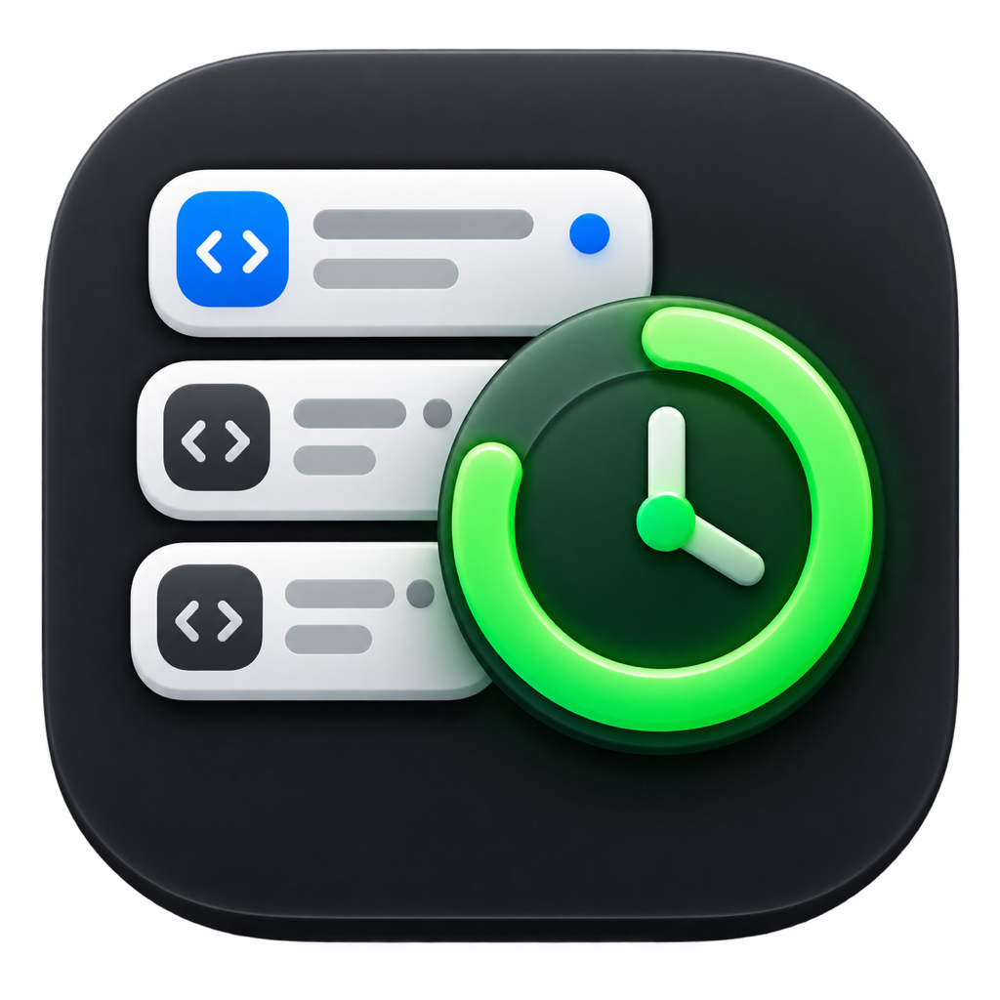

# Claude Cache Watch



A macOS App and local CLI that estimate the remaining prompt-cache TTL for Claude Code Desktop sessions. Both read only local files under `~/.claude`; they do not send prompts or call the Anthropic API.

Claude's prompt cache is server-side. The local JSONL records include cache read/write token counts, the cache TTL used (`5m` or `1h`), and event timestamps, but not a server-confirmed expiry timestamp. The CLI therefore reports a narrow estimate bounded by the local event immediately before the request and the first assistant event for that request.

All displayed timestamps use SGT (Singapore time).

## Requirements

- macOS 14 or later
- Xcode Command Line Tools with Swift 5.10 or later
- Python 3.10 or later
- Claude Code Desktop with local session data under `~/.claude`

## macOS App

Build the App locally, then open the generated bundle:

```bash
./scripts/build-app.sh
open "dist/Claude Cache Watch.app"
```

Double-click the App to open the session window. The window provides:

- one clear remaining-time value per monitored session;
- inactive Desktop sessions remain visible while their latest cache may still be valid;
- the latest model, a compact project path, and the latest instruction;
- responsive session rows and text sizing based on both window width and height;
- a compact bottom status bar with active-session count and controls;
- a persistent window pin button that keeps the monitor above normal windows;
- click a session row to activate Claude Code Desktop;
- context menu actions to open the project folder or copy the session ID.

Claude Desktop's documented deep links can open a new Code session, but do not currently expose a route for opening an existing local Code session by session ID. For that reason, row clicks activate Claude Desktop without creating or resuming another session.

The App looks for Python in `CLAUDE_CACHE_WATCH_PYTHON`, `/opt/homebrew/bin/python3`, `/usr/local/bin/python3`, and `/usr/bin/python3`, in that order. The generated App is ad-hoc signed for local use; distributing a notarized binary requires your own Apple Developer signing identity.

## CLI

```bash
python3 claude_cache_watch.py
```

By default, only running sessions whose entry point is `claude-desktop` are shown.

```bash
# Refresh every second
python3 claude_cache_watch.py --watch

# Refresh every five seconds
python3 claude_cache_watch.py --watch 5

# Include inactive Desktop session history
python3 claude_cache_watch.py --all --limit 30

# Inspect one session by ID prefix
python3 claude_cache_watch.py abcd1234

# Machine-readable output
python3 claude_cache_watch.py --json

# Include Claude Code CLI sessions
python3 claude_cache_watch.py --all --include-cli

# Keep inactive Desktop sessions until their cache is definitely expired
python3 claude_cache_watch.py --keep-valid-cache
```

## Optional installation

```bash
uv tool install --editable .
claude-cache-watch --watch
```

## Status values

- `VALID`: the cache is still valid even using the conservative request-start estimate.
- `UNCERTAIN`: the current time falls inside the local timestamp uncertainty interval.
- `PARTIAL`: a session uses both TTLs and only part of the cached content is definitely valid.
- `EXPIRED`: the latest observed cached request has passed its TTL.
- `NO_CACHE`: no cache read/write usage was found in the transcript.
- `NO_DATA`: an active session registration exists, but its transcript is unavailable.

Cache content can also be invalidated before TTL expiry by changes to tools, system instructions, messages, model behavior settings, or other prompt inputs. The CLI cannot confirm server-side invalidation; it reports time-based eligibility only.

The TTL and refresh behavior follow Anthropic's official [prompt caching documentation](https://platform.claude.com/docs/en/build-with-claude/prompt-caching).

## Privacy

Claude Cache Watch reads Claude Code session files only from the local machine. It does not send session IDs, project paths, prompts, or usage data over the network. Session content and generated App bundles are excluded from the repository.

This is an independent project and is not affiliated with or endorsed by Anthropic.

## Development

```bash
python3 -m unittest discover -s tests
swift build --package-path macos
```

## License

[MIT](LICENSE)
